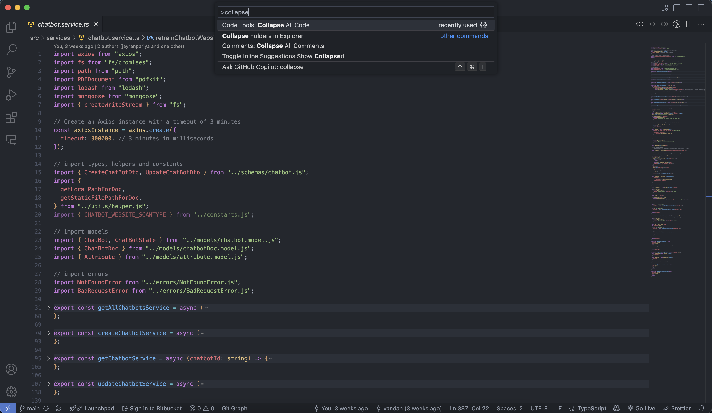

# 📦 Collapse All Code (One-Click Fold Extension)

Effortlessly collapse all functions and foldable blocks in your file with a single click. Perfect for large Next.js, React, and TypeScript files.

## ✨ Features

- 🔘 Adds a custom button to the editor title bar
- 🧠 Collapses all foldable ranges (functions, objects, blocks)
- 💻 Works with TypeScript, JavaScript, and more
- 🎯 Designed for large codebases
- 🎨 Dark and light mode SVG icons

## 📷 Screenshot

## 🚀 Usage

- Click the 🡇 icon in the top-right of your editor
- Or run the `Collapse All Code` command from the Command Palette (`Cmd+Shift+P`)
- (Optional) Use keyboard shortcut: `Ctrl+Alt+K`

## 🔧 Requirements

None – it just works!

## 💬 Feedback

Found a bug or want a new feature? [Open an issue](https://github.com/Vandan2912/one-click-fold-extension)
